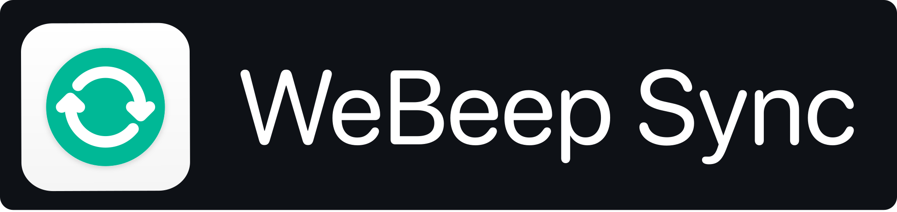

> For the combined app and Transcriber, use the [repository setup guide](../README.md). Release links below describe the original upstream app.

<div align="center">
    
</div>

<div align="center">
    <a href="https://github.com/toto04/webeep-sync/releases/latest/download/WeBeep.Sync.macOS-x64.dmg">
        
    </a>
    <a href="https://github.com/toto04/webeep-sync/releases/latest/download/WeBeep.Sync.macOS-arm64.dmg">
        
    </a>
    <a href="https://github.com/toto04/webeep-sync/releases/latest/download/WeBeep.Sync.Windows.Setup.zip">
        
    </a>
    <a href="https://github.com/toto04/webeep-sync/releases/latest/download/webeep-sync-debian.deb">
        
    </a>
    <a href="https://github.com/toto04/webeep-sync/releases/latest/download/webeep-sync-redhat.rpm">
        
    </a>
</div>

<div align="center">
    <a href="https://www.paypal.com/donate/?hosted_button_id=JXRZNQKNHYJ2Y">
        
    </a>
</div>

---


[](https://www.paypal.com/donate/?hosted_button_id=JXRZNQKNHYJ2Y)

### [🇬🇧 click here for English version](https://github.com/toto04/webeep-sync#english-version)

WeBeep Sync è una semplice app che serve per tenere sincronizzati tutti i tuoi file di WeBeep,
User-Friendly e senza compromessi.

Sto sviluppando quest'app come strumento ad uso personale, ma ho pensato potesse essere utile ad
altri studenti, perciò è completamente opensource e gratuita sotto [licenza GPLv3](LICENSE).

### Cos'è esattamente?

WeBeep Sync stata pensata come un sostituto a [PoliBeepSync](https://github.com/Jacotsu/polibeepsync/)
visto che non sarebbe stato aggiunto il supporto per WeBeep.
Punta a essere una soluzione più user-firendly, completa e definitiva di
[Moodle Downloader 2](https://github.com/C0D3D3V/Moodle-Downloader-2), il mio obiettivo era di avere
qualcosa che puoi scaricare e dimenticartene, essendo sicuro che tutti i file di WeBeep saranno
sempre aggiornati.

### A cosa serve?

Proprio come PoliBeepSync, serve per tenere sincronizzati i propri file di WeBeep in una cartella
locale sul proprio PC. Se vuoi un'esperienza senza pensieri, puoi lasciare che l'app si apra in
background e puoi scegliere ogni quanto avverranno le sincronizzazioni, così da avere sempre tutti i
file aggiornati. Oppure puoi disattivare l'autosync e scaricare tutti i file in una volta sola
quando preferisci.


## Download

Nelle release di Github puoi trovare l'app già impacchettata e pronta da usare per Windows e macOS
(sia x64 che M1)

### [Ultima Release](https://github.com/toto04/webeep-sync/releases/latest)

Puoi usare i seguenti link per scaricare direttamente la versione più adatta a te

### Windows

#### [Installer x64](https://github.com/toto04/webeep-sync/releases/latest/download/WeBeep.Sync.Windows.Setup.zip)

### macOS

#### [dmg x64 (Intel)](https://github.com/toto04/webeep-sync/releases/latest/download/WeBeep.Sync.macOS-x64.dmg)

#### [dmg arm64 (M1 o superiore)](https://github.com/toto04/webeep-sync/releases/latest/download/WeBeep.Sync.macOS-arm64.dmg)

#### "WeBeep Sync" è danneggiato e non può essere aperto. Come risolvere?

Per colpa del fatto che non ho un account da sviluppatore con cui firmare un certificato perché
costa troppo, macOS considera il file come proveniente da uno sviluppatore non indentificato e
blocca l'avvio.

Per ovviare a questa lieve inconvenienza, bisogna manualmente dare i permessi di esecuzioni all'app.
Per fare ciò, _una volta spostato WeBeep Sync nella cartella Applicazioni_, apri il Terminale e
incolla queto comando

```sh
sudo xattr -rd com.apple.quarantine /Applications/WeBeep\ Sync.app
```

e dovrebbe tutto funzionare senza problemi

### Linux

#### [.deb (Debian based, tipo Ubuntu)](https://github.com/toto04/webeep-sync/releases/latest/download/webeep-sync-debian.deb)

#### [.rpm (RedHat based, tipo Fedora)](https://github.com/toto04/webeep-sync/releases/latest/download/webeep-sync-redhat.rpm)

### Installazione manuale (istruzioni di compilazione)

Segui la [guida alla configurazione del repository](../README.md) per installare anche Transcriber e PoliWebex. Dalla radice del repository:

```sh
python3 scripts/workspace.py setup
python3 scripts/workspace.py start
```

Per creare il pacchetto Electron:

```sh
cd webeep-sync-recordings
pnpm make
```

Per maggiori informazioni, dai un'occhiata agli script in `package.json` e alla documentazione
della CLI di [Electron Forge](https://www.electronforge.io/cli), dove puoi trovare istruzioni su
come modificare il file `forge.config.js` a tuo gradimento per creare un package che fa al caso
tuo

## Informazioni sull'app

L'app è basata su [Electron](https://www.electronjs.org), scritta usando
[Typescript](https://www.typescriptlang.org) e [React](https://it.reactjs.org).
È stata creata usando [Electron Forge](https://www.electronforge.io/) ed è pubblicata con la licenza
GPLv3.

Se vuoi aiutare lo sviluppo dell'app proponendo bug-fixes o nuove feature, puoi aprire una
[issue](https://github.com/toto04/webeep-sync/issues/new).

Per qualsiasi altra informazione, spero che i commenti che ho lasciato in giro siano abbastanza
chiari, altrimenti idk scrivimi un'email I guess.

Oppure se trovia particolarmente utile l'app, puoi offrirmi un caffè dondomi qualche spicciolo su
PayPal (che magari così chissà che potrei anche arrivare a permettermi un account da sviluppatore
Apple 🤷‍♂️)

[](https://www.paypal.com/donate/?hosted_button_id=JXRZNQKNHYJ2Y)

Grazie mille 🥺❤️

## Features

-   scarica tutti i file da WeBeep con un solo click nella cartella che preferisci
-   puoi rinominare le cartelle dei singoli corsi
-   puoi selezionare quali dei tuoi corsi sincronizzare
-   puoi configurare l'app per rimanere aperta in background, e impostare ogni quanto fare un autosync
-   puoi scegliere di avviare l'app al login, silenziosamente per assicurarti di avere sempre i file
    aggiornati
-   puoi selezionare tra tema chiaro 🌞 e scuro 🌚
-   disponibile sia in Italiano 🇮🇹 che in Inglese 🇬🇧
-   voglio dire è un'app per scaricare dei file non so quante funzioni potrebbe mai avere
-   non so più cosa inventarmi come "features", cioè scaricala e vedi, al massimo la cancelli se non
    ti piace idk, non pesa nemmeno poi molto dai

Ok ma cosa si scrive in fondo a un README? Cioè qualcuno legge anche fino in fondo?
Ecco video di gattini come ricompensa per essere arrivato fin quaggiù:
**_[link](https://youtu.be/dQw4w9WgXcQ)_**

---

# English Version:

[](https://www.paypal.com/donate/?hosted_button_id=JXRZNQKNHYJ2Y)

WeBeep Sync is a simple app that is used to keep all your WeBeep files synchronized,
User-Friendly and uncompromising.

I'm developing this app as a tool for personal use, but I thought it might be useful to
other students, so it's completely opensource and free under the [GPLv3 license](LICENSE).

### What is it exactly?

WeBeep Sync was intended as a replacement for [PoliBeepSync](https://github.com/Jacotsu/polibeepsync/)
since support for WeBeep would not be added.
It aims to be a more user-firendly, complete and definitive solution than
[Moodle Downloader 2](https://github.com/C0D3D3V/Moodle-Downloader-2), my goal was to have
something you can download and forget about, being sure that all the WeBeep files will be
always up to date.

### What is it for?

Just like PoliBeepSync, it serves to keep your WeBeep files synchronized in a local folder on your
folder on your PC. If you want a worry-free experience, you can let the app open in the
background and you can choose how often the synchronizations will take place, so you will always have all your
files up to date. Or you can turn off autosync and download all your files at once
when you like.


## Downloads

In the Github releases you can find the app already packaged and ready to use for Windows and macOS
(both x64 and M1)

### [Latest Release](https://github.com/toto04/webeep-sync/releases/latest)

You can use the following links to directly download the version that suits you best

### Windows

#### [Installer x64](https://github.com/toto04/webeep-sync/releases/latest/download/WeBeep.Sync.Windows.Setup.zip)

### macOS

#### [dmg x64 (Intel)](https://github.com/toto04/webeep-sync/releases/latest/download/WeBeep.Sync.macOS-x64.dmg)

#### [dmg arm64 (M1 or higher)](https://github.com/toto04/webeep-sync/releases/latest/download/WeBeep.Sync.macOS-arm64.dmg)

#### "WeBeep Sync" is damaged and can't be opened. How to solve it?

Due to the fact that I don't have a developer account with which to sign a certificate because it
cost too much, macOS considers the file as coming from an unidentified developer and
blocks the startup.

To get around this minor inconvenience, you have to manually give the app execution permissions.
To do this, _once you've moved WeBeep Sync to the Applications folder_, open the Terminal and
paste this command

```sh
sudo xattr -rd com.apple.quarantine /Applications/WeBeep\ Sync.app
```

and everything should work without problems

### Linux

#### [.deb (Debian based, like Ubuntu)](https://github.com/toto04/webeep-sync/releases/latest/download/webeep-sync-debian.deb)

#### [.rpm (RedHat based, like Fedora)](https://github.com/toto04/webeep-sync/releases/latest/download/webeep-sync-redhat.rpm)

### Manual installation (compile instructions)

Follow the [repository setup guide](../README.md) to install Transcriber and PoliWebex as well. From the repository root:

```sh
python3 scripts/workspace.py setup
python3 scripts/workspace.py start
```

To build the Electron package:

```sh
cd webeep-sync-recordings
pnpm make
```

For more information, have a look at the scripts in `package.json` and the documentation of the
CLI documentation for [Electron Forge](https://www.electronforge.io/cli), where you can find
instructions on how to modify the file `forge.config.js` to your liking to create a package
that suits your needs

## About the app

The app is based on [Electron](https://www.electronjs.org), written using
[Typescript](https://www.typescriptlang.org) and [React](https://it.reactjs.org).
It was created using [Electron Forge](https://www.electronforge.io/) and is licensed under the
GPLv3 license.

If you want to help the development of the app by proposing bug-fixes or new features, you can open an
[issue](https://github.com/toto04/webeep-sync/issues/new).

For any other information, I hope the comments I left around are clear enough, otherwise idk write
me an email I guess.

Or if you find the app particularly useful, you can buy me a coffee and give me some change on
PayPal (which maybe then who knows I might even get to afford an Apple developer account 🤷‍♂️)

[](https://www.paypal.com/donate/?hosted_button_id=JXRZNQKNHYJ2Y)

Thank you very much 🥺❤️

## Features

-   download all the files from WeBeep with a single click in the folder you prefer
-   you can rename the folders of individual courses
-   you can select which of your courses to synchronize
-   you can configure the app to stay open in the background, and set how often to do an autosync
-   you can choose to start the app when you login, silently to make sure you always have the latest files
    updated
-   you can select between light 🌞 and dark 🌚 theme
-   available in both Italian 🇮🇹 and English 🇬🇧.
-   I mean it's an app to download files I don't know how many functions it could possibly have.
-   I don't know what to come up with as "features" anymore, i.e. download it and see, at most delete it if you don't
    you don't like idk, it doesn't even weigh that much.

Ok but what is written at the bottom of a README? I mean does anyone read all the way to the bottom?
Here is a video of kittens as a reward for getting this far:
**_[link](https://youtu.be/dQw4w9WgXcQ)_**
